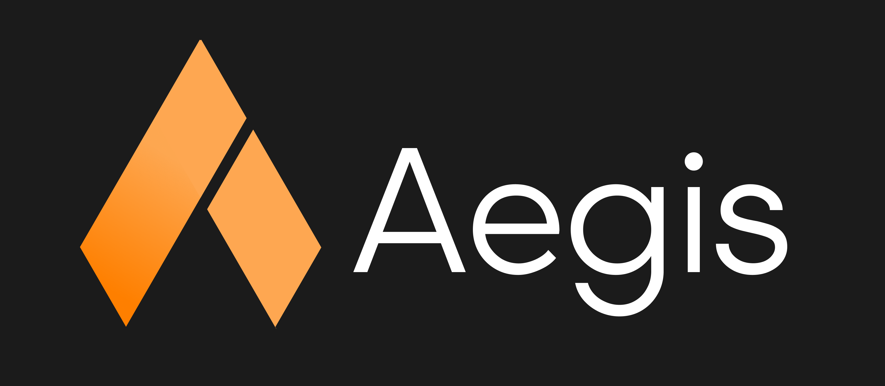
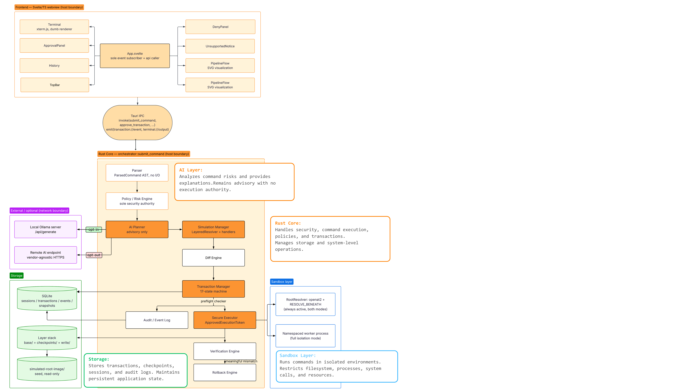

<p align="center">
  
</p>

<p align="center">
  A transactional shell sandbox — every command is parsed, risk-classified, simulated,
  explained, approved where warranted, executed, verified, and reversible.
</p>

---

## What it is

Aegis is a native Linux desktop application (Rust + Tauri core, Svelte/TS frontend) that wraps
shell command execution in a transaction pipeline instead of running commands raw:

```
Command → Parse → Policy → AI (advisory) → Simulate → Diff → Approve → Snapshot
        → Execute → Verify → Commit | Rollback
```

It is **not** a command blocker. Destructive operations like `rm -rf` are not denied — they are
simulated in a disposable environment first, so you see exactly what will change, approve or
reject the operation with full information, and get an automatic, verified rollback if execution
ever diverges from what was predicted. The one thing it never permits is an operation that would
breach its own sandbox boundary — that class of request is denied outright and is not
user-overridable.

## Core principle

> **DANGEROUS is not the same as DENIED.**
> **UNSAFE-TO-CONTAIN is not the same as ALLOWED.**

Every parsed command resolves to exactly one of three categories:

| Category | Meaning | Behavior |
|---|---|---|
| **Safe / Supported** | Low risk, effects fully captured by the snapshot mechanism | Executes immediately — full pipeline still runs and is audited, no approval pause |
| **Dangerous but Contained** | Destructive or wide-scoped, but entirely reversible inside the sandbox | Simulated, explained, and **approval-gated** — snapshotted, executed, verified, committed or rolled back |
| **Unsafe to Contain** | Would breach the sandbox boundary itself | **Denied**, deterministically, with a factual reason — never user-overridable |

## Architecture

<p align="center">
  
</p>

The frontend is a pure renderer of an event stream — it holds no risk logic of its own. Every
command flows through the Rust core: **Parser** → **Policy/Risk Engine** (the sole security
authority) → **AI Planner** (advisory only, zero ability to approve/deny/execute) → **Simulation
Manager** (runs the real handler code against a disposable layer) → **Diff Engine** → **Transaction
Manager** (a 17-state machine) → **Snapshot Manager** → **Secure Executor** → **Verification
Engine** → **Rollback Engine**. Isolation for real execution is provided by Linux namespaces,
`openat2`/`RESOLVE_BENEATH` path resolution, OverlayFS-backed layering, seccomp-bpf, Landlock, and
cgroups v2. Full breakdown, component responsibilities, and the frozen reference snapshot this
diagram was generated from: **[`docs/CLAUDE.md`](docs/CLAUDE.md)** and
**[`docs/architecture-diagram.md`](docs/architecture-diagram.md)**.

## Key features

- **Predictive diff before execution** — simulation and execution share the identical handler
  code, so the predicted diff you approve is what will actually happen, not a guess.
- **Explicit, informed approval** — Approve and Reject are presented as equals; the panel shows
  what will change, why it's classified as it is, and an AI-generated plain-language explanation.
- **Deterministic, automatic rollback** — a checkpoint is taken immediately before execution; if
  the real result diverges from the prediction, Aegis rolls back on its own.
- **AI is strictly advisory** — the AI planner can explain risk but has no code path into policy,
  execution, or recovery; those modules have zero dependency on the AI layer.
- **Real Linux isolation** — user/mount/PID namespaces, OverlayFS, seccomp-bpf, Landlock, and
  cgroups v2, with automatic, disclosed fallback chains when a primitive isn't available.
- **Full transaction history** — every command, whether it paused for approval or not, is
  recorded, replayable, and (within the retention window) recoverable.

## Run it

```bash
cd src-tauri && cargo check          # fast loop
npm run tauri dev                    # full app, native window
```

See [`docs/CLAUDE.md`](docs/CLAUDE.md) for the full working contract and build order, and
`src-tauri/.env.example` for local AI/Ollama configuration (Aegis runs fully without it — the AI
layer is optional; only its advisory explanations are unavailable when it's off).

## Command support

Every command resolves to one of four policy tiers before any handler runs
(`policies/supported_commands.toml`):

- **Implemented** (same handler for simulation and real execution): `pwd`, `cd`, `mkdir`, `touch`,
  `ls`, `cat`, `echo`, `rm` (`-r`/`-R`/`-f`, basic `*` glob expansion).
- **Policy-recognized, not yet implemented** — rejected at policy time with a plain "not
  implemented" notice, not a security denial: `rmdir`, `cp`, `mv`, `chmod`, `chown`, `ln`, `grep`,
  `find`, `head`, `tail`, `wc`, `mkfifo`, `export`, `env`, `which`, `history`, `ps`, `kill`.
- **Always denied** — shell invocation (`bash`, `sh`) and anything that would touch the real host
  filesystem or a host process directly.

## Documentation

- **[`docs/CLAUDE.md`](docs/CLAUDE.md)** — the working contract: architecture overview, every
  non-negotiable invariant, repository layout, build order, and testing requirements.
- **[`docs/architecture.md`](docs/architecture.md)** — the authoritative design spec.
- **[`docs/architecture-diagram.md`](docs/architecture-diagram.md)** — the diagram source (Mermaid)
  behind the architecture image above, plus the ambiguities it had to resolve against the code.
- **[`docs/threat_model.md`](docs/threat_model.md)**, **[`docs/security_claims.md`](docs/security_claims.md)**
  — what Aegis defends against, and the canonical wording for what it claims (and explicitly does
  not claim — no universal safety, no VM-level isolation, no AI-certified safety).
- **[`docs/benchmarks.md`](docs/benchmarks.md)** — real, measured latency numbers from the test
  suite for the safe-path and denied-path pipelines.

## Tech stack

**Core:** Rust, Tauri 2, `nix`/`libc`, `seccompiler`, `landlock`, `rusqlite` (SQLite), `ureq`,
`serde`. **AI:** local Ollama (optional, `NullBackend` fallback when disabled). **Frontend:**
Svelte 5, TypeScript, Vite, xterm.js. **Isolation:** Linux namespaces, OverlayFS, seccomp-bpf,
Landlock, cgroups v2 — rootless, no VM, no container orchestration.
